# Automação de Atendimento Gestantes

Programa de apoio para as enfermeiras lançarem os dados do atendimento
de gestantes diretamente numa planilha Excel Online (SharePoint), sem
precisar digitar linha por linha manualmente, recomendado o uso ao 
final do expediente.

## Segurança leia antes de usar

- O programa **nunca salva e-mail ou senha** em nenhum arquivo, log ou
  configuração. Essas informações ficam só na memória enquanto o
  programa está rodando e são apagadas da tela assim que o botão
  "Iniciar" é clicado.
## Como usar

### 1. Baixar o programa

No repositório do GitHub, clique no botão verde **"Code"** e depois em
**"Download ZIP"**.


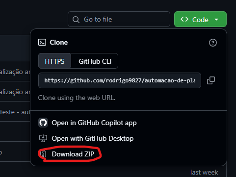

O arquivo `automacao-de-planilha-main.zip` vai aparecer nos seus
Downloads.

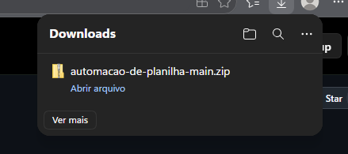

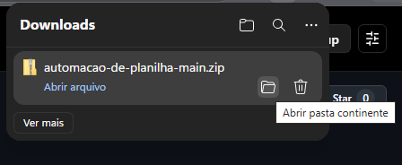

### 2. Extrair o arquivo

Clique com o botão direito no `.zip` e escolha **"Extrair Tudo..."**.

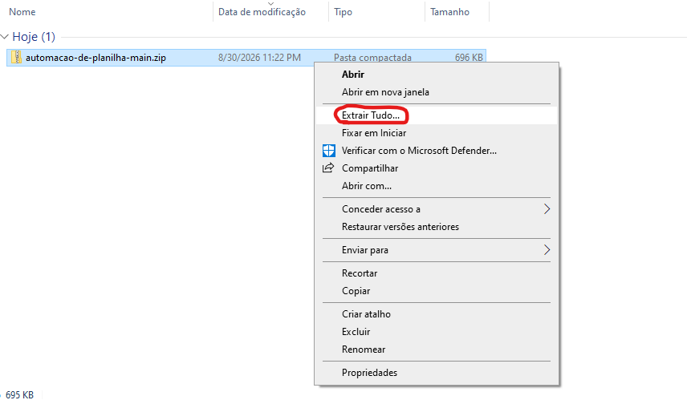

Confirme a pasta de destino e clique em **"Extrair"**.

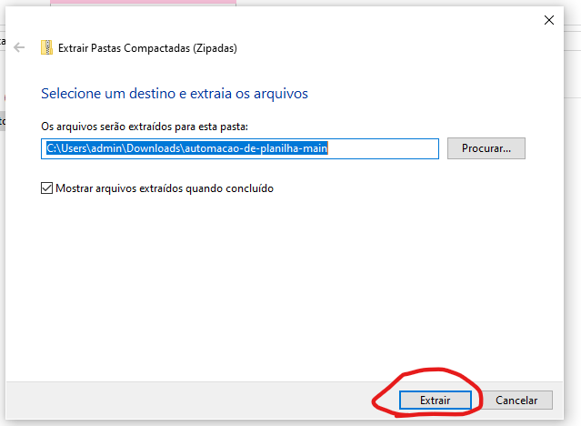

Depois de extrair, entre na pasta gerada (`automacao-de-planilha-main`).

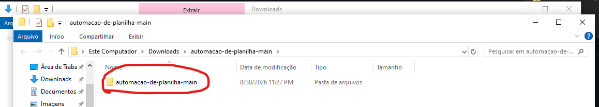

### 3. Mover o inicializador para a Área de Trabalho

Dentro da pasta extraída, arraste o arquivo **`inicializacao.bat`**
para a Área de Trabalho, assim fica mais fácil de abrir depois, sem
precisar navegar até a pasta toda vez.

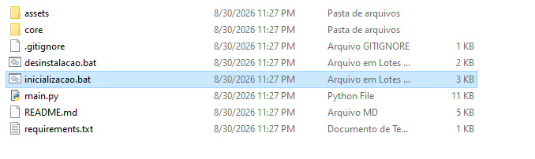

### 4. Executar o inicializador

Dê dois cliques no atalho `inicializacao.bat` que ficou na Área de
Trabalho.

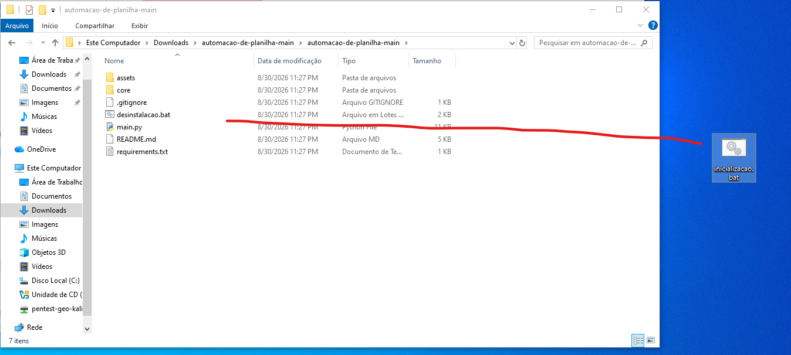


Na primeira vez, ele verifica se o Python está instalado, se não
estiver, baixa e instala sozinho automaticamente. Isso pode levar
alguns minutos; acompanhe pela janela preta que abre.

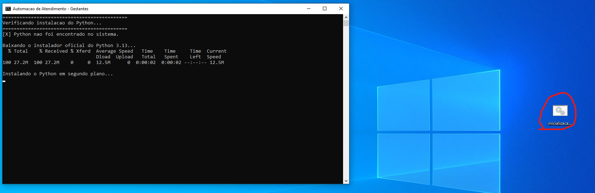

Quando terminar, a janela do programa abre sozinha.

### 5. Pegar o link da planilha

Abra a planilha no Excel Online (SharePoint) e copie o link direto da
barra de endereço do navegador.

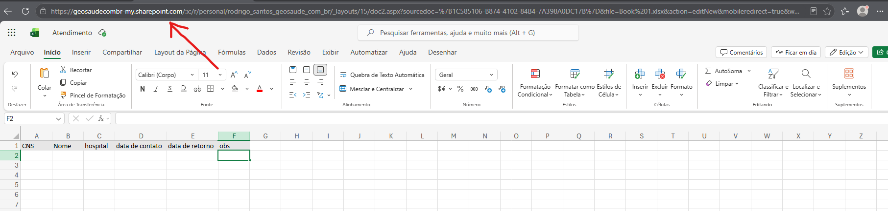

Cole esse link no campo **"Link da planilha"** do programa.

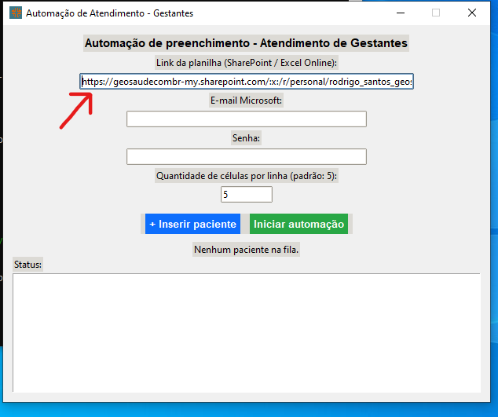

### 6. Preencher e-mail, senha e quantidade de células

Preencha o **e-mail** e a **senha** da conta Microsoft, e confirme a
**quantidade de células por linha** de acordo com o número de colunas
da planilha (no exemplo, 5 colunas: CNS, Nome, hospital, data de
contato, data de retorno, obs).

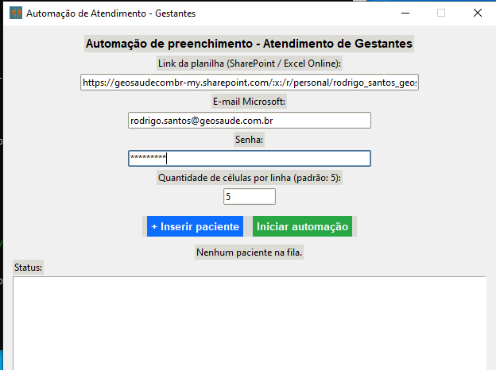

### 7. Cadastrar um paciente

Clique em **"+ Inserir paciente"**.

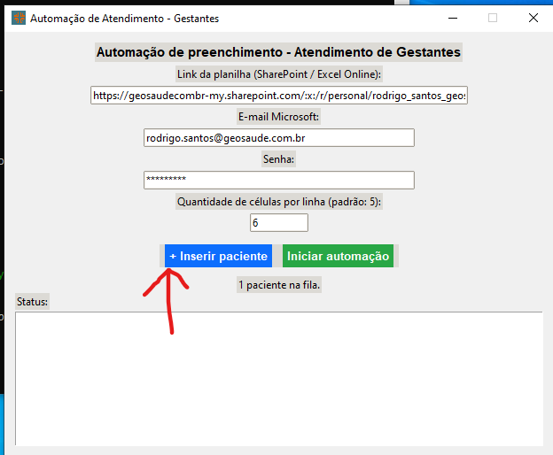

Uma janela abre com um campo de texto único digite as informações,
uma por linha (cada linha vira uma célula da planilha, na ordem em que
aparece). Deixe uma linha em branco se quiser pular uma célula.

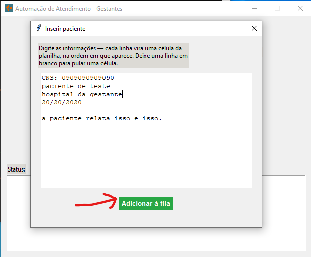

Clique em **"Adicionar à fila"**.

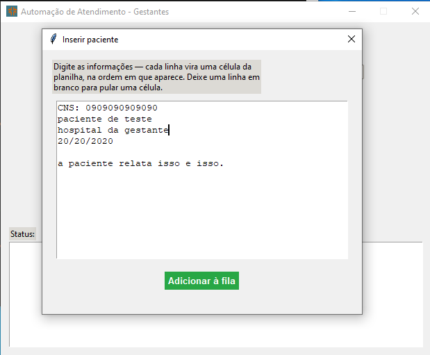

O contador na tela principal mostra quantos pacientes já estão na
fila, repita esse passo pra cada paciente da rodada.

### 8. Iniciar a automação

Com a fila pronta, clique em **"Iniciar automação"**.

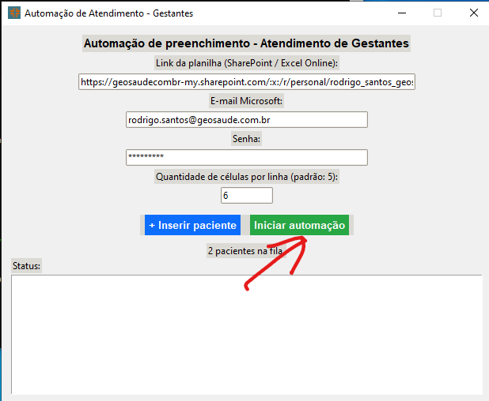

# Como desinstalar

Guia rápido para remover o programa e, se quiser, o Python do
computador.

### 1. Abra a pasta do projeto e localize o `desinstalacao.bat`

Dentro da pasta onde o programa foi extraído (`assets`, `core`,
`main.py`, etc.), clique no arquivo `desinstalacao.bat` para
selecioná-lo.

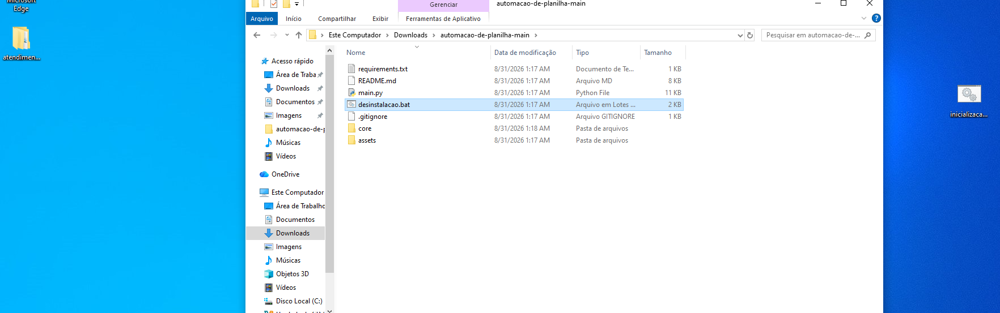

### 2. Confirme os arquivos da pasta

Confira se está na pasta certa, ela deve conter o `atendimento_rodada`
(se já tiver rodado o programa antes) e o `inicializacao.bat` junto
dos outros arquivos.

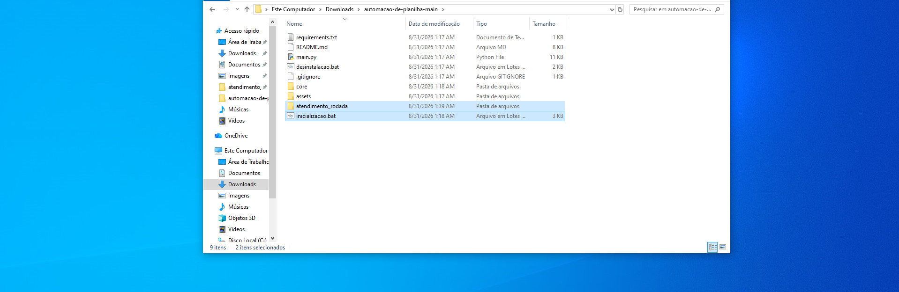

### 3. Dê dois cliques no `desinstalacao.bat`

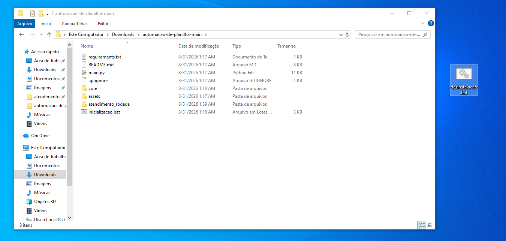

### 4. Responda se quer desinstalar o Python

Uma janela preta abre perguntando **"Deseja desinstalar o Python do
computador? (S/N)"**. Digite `S` para remover o Python também, ou `N`
para manter o Python instalado e remover só o programa.

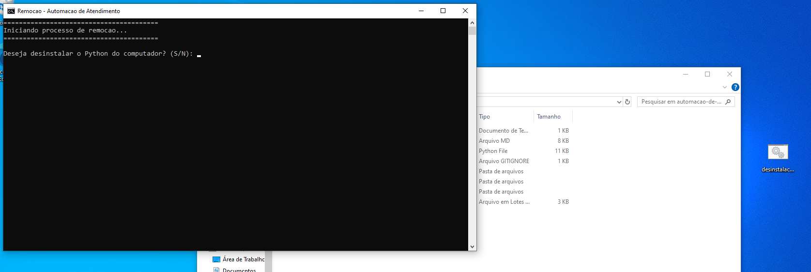

### 5. Confirme a remoção da pasta

Se respondeu `S`, o Python é desinstalado primeiro. Em seguida, o
script mostra exatamente qual pasta vai apagar e pede confirmação:
digite `S` novamente para confirmar.

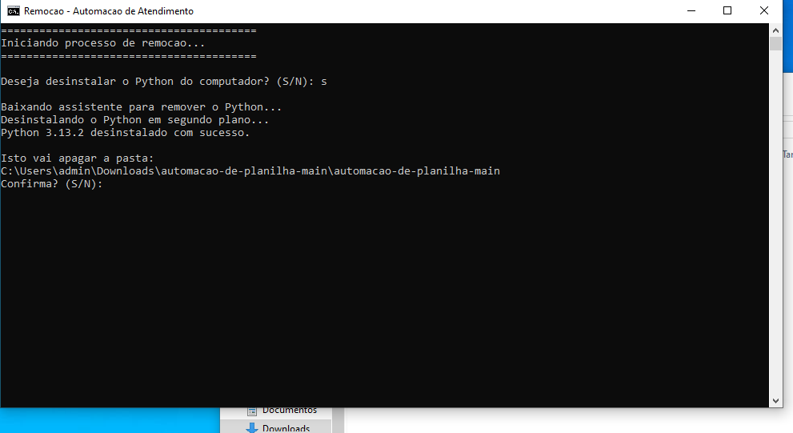

### 6. Pronto

A pasta do programa é removida.

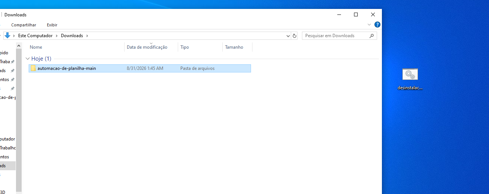

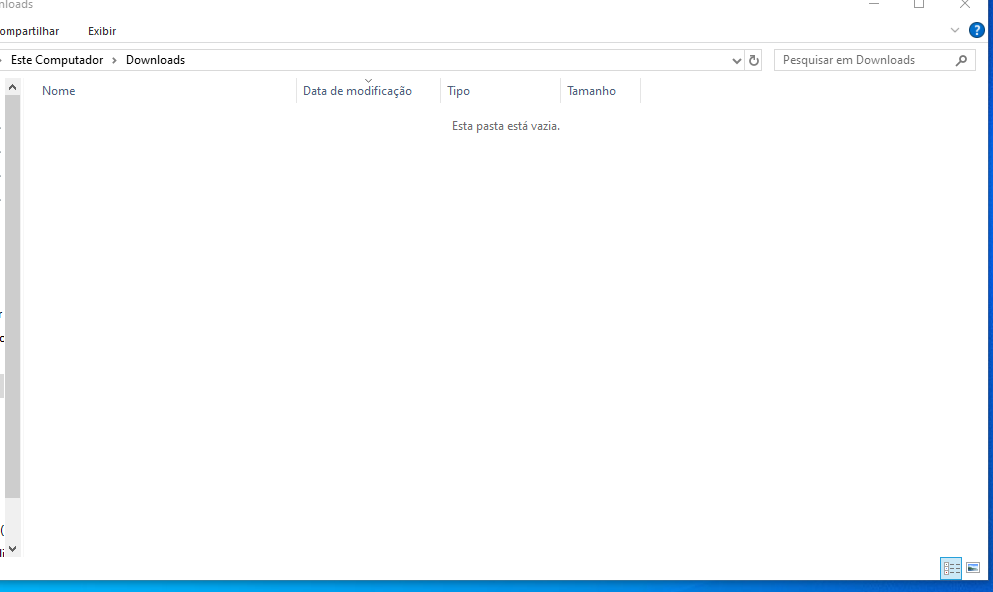

## Importante

- A pergunta sobre o Python e a pergunta sobre apagar a pasta são
  **duas confirmações separadas** dá pra manter o Python e remover
  só o programa, ou vice-versa.
- Isso não afeta os dados já lançados na planilha, só remove os arquivos do programa no computador local.

## Uso por outros setores

O botão **"+ Inserir paciente"** abre uma janela com uma única caixa
de texto, onde cada linha digitada vira uma célula da planilha, sem
nenhum campo fixo. Serve tanto para o setor de
atendimento a gestantes quanto para qualquer outro setor que precise
inserir uma linha de dados numa planilha com este
programa.

## Como funciona

1. Executa `inicializacao.bat`, que verifica/instala o Python e as
   dependências, e abre a interface do programa.
2. Clica em **"+ Inserir paciente"** e digita as informações na caixa
   de texto, cada linha vira uma célula da planilha, na ordem em que
   aparece. Deixar uma linha em branco pula uma célula. 
   O programa gera o arquivo `.txt` sozinho
   na pasta `atendimento_rodada`, na Área de Trabalho. Não precisa
   mais abrir o Bloco de Notas na mão.
   - Repete esse passo para cada paciente da rodada. O contador na
     tela mostra quantos pacientes estão na fila para inserir na planilha.
3. Na interface, informa:
   - o link da planilha (Excel Online / SharePoint)
   - o e-mail e a senha da conta Microsoft
   - quantas células por linha a planilha usa (padrão: 5)
4. Com a fila pronta, clica em "Iniciar automação". O programa abre
   o Edge, faz login, aguarda a planilha carregar e digita os dados
   de cada paciente/registro, célula por célula, pulando de linha
   automaticamente.
5. Ao final, os arquivos `.txt` já processados são movidos para
   `atendimento_rodada/processados/<data>/` (não é necessário)
   apagar os arquivos manualmente.

## Formato do arquivo de paciente

Cada linha do `.txt` vira uma célula da planilha, na ordem em que
aparece. Uma linha em branco cria uma célula vazia de propósito
(pressione Enter para deixar uma célula em branco). Exemplo digitado
na caixa de texto:

```
CNS:123456789
nome do paciente de exemplo
atendeu
Próxima ligação: 25/12/2026

observações
```

- Nome do arquivo não importa para o sistema só evite espaços,
  prefira `_` (underline).
- Recomendado salvar sempre em `atendimento_rodada`, e não direto na
  pasta do programa.

## Requisitos técnicos

- Windows com Microsoft Edge instalado (a automação abre o Edge
  controlada pelo Selenium).
- Conexão com a internet (para instalar o Python/dependências na
  primeira vez, e para o Selenium baixar automaticamente o driver do
  Edge compatível com a versão instalada).
- Conta Microsoft **sem verificação em duas etapas (MFA)**  se a
  conta tiver MFA ativado, o login automático vai parar na etapa do
  código/aprovação e vai ser necessário completar manualmente na
  janela aberta.
- Se o navegador já estiver com a sessão da Microsoft em cache (SSO),
  o programa detecta isso automaticamente e pula a etapa de login,
  indo direto para o preenchimento, não precisa se preocupar em
  deslogar antes de testar.

## Limitações conhecidas

- Antes de começar a digitar, o programa usa o atalho Ctrl+End para
  pular para a última célula com dado na planilha e começar a
  próxima linha a partir dali, assim nunca sobrescreve o que já foi
  preenchido antes (por outra pessoa ou numa rodada anterior). Isso
  depende do comportamento padrão do Ctrl+End 
- O navegador é deixado aberto ao final da execução, de propósito,
  para conferência visual antes de fechar manualmente.

## Estrutura do projeto

```
automacao-atendimento/
├── main.py                 # interface (Tkinter) ponto de entrada
├── core/
│   ├── pacientes.py         # leitura e organização dos arquivos .txt
│   └── web_automation.py    # login e preenchimento via Selenium
├── assets/                  # imagens
├── requirements.txt
├── inicializacao.bat
├── desinstalacao.bat
└── .gitignore
```

## Desinstalação

Execute `desinstalacao.bat`. Ele pede confirmação antes de apagar a
pasta do programa, e pergunta separadamente se deseja também
desinstalar o Python (opcional).
